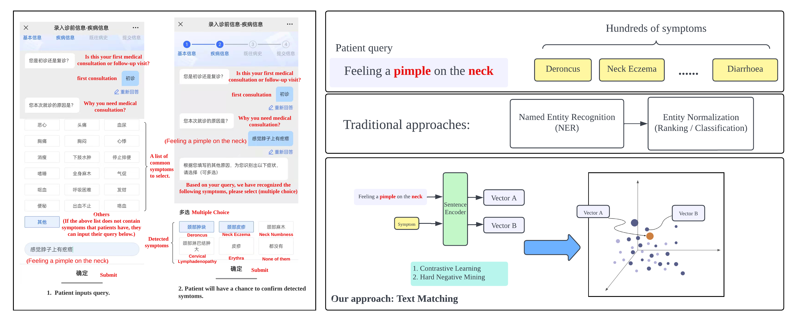
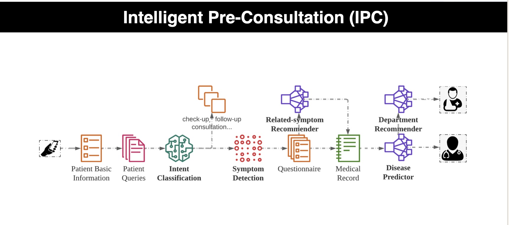

# Medical Symptom Detection in Intelligent Pre-Consultation using Bi-directional Hard-Negative Noise Contrastive Estimation 

This repository holds the source code for our KDD 2022 paper titled: [Paper](https://dl.acm.org/doi/pdf/10.1145/3534678.3539124)

<!-- Thanks for your interest in our repo! -->

## Overview

Our approach to symptom detection in medical queries within intelligent pre-consultation (IPC) takes into consideration the colloquial language typically used. Rather than treating the task as a medical concept normalization problem, we approach it as a retrieval problem. To accomplish this, we introduce a bi-directional hard-negative enforced noise contrastive estimation model (Bi-hardNCE) for symptom detection. We demonstrate that our proposed model surpasses popular retrieval models as well as the current state-of-the-art NCE model which uses in-bath negatives.



The Intelligent pre-consultation (IPC) system is a pre-diagnosis tool designed to enhance the efficiency and productivity of healthcare delivery. It replicates the logic of medical diagnosis, allowing for the collection of patient information in advance, thus reducing the need for doctors to interact with patients, resulting in time-saving. The IPC framework includes key components like a basic information collector, intention classifier, symptom detector, and medical record generator, as shown in the figure below. 




### Train Bi-hardNCE
In the following section, we describe how to train a Bi-hardNCE model by using our code.

### Requirements
- python3.6
- pip install -r requirements.txt

### Downloading Chinese Bert
```bash
python download_chinese_bert.py 
```
 
### Training

In comparison to the traditional deep learning training, the training process for Bi-hardNCE varies slightly. Following each epoch, the model evaluates the validation data to modify the threshold for hard-negative mining. Subsequently, the model performs hard-negative mining on the training data and adds fresh hard negatives for each training instance.

```bash
sh bihdnce.sh
```

### Evaluation
```bash
python Evaluation.py
```

## Citation

Please cite our paper if you use Bi-hardNCE in your work:

```bibtex
@inproceedings{zhang2022medical,
  title={Medical Symptom Detection in Intelligent Pre-Consultation using Bi-directional Hard-Negative Noise Contrastive Estimation},
  author={Zhang, Shiwei and Sun, Jichao and Huang, Yu and Ding, Xueqi and Zheng, Yefeng},
  booktitle={Proceedings of the 28th ACM SIGKDD Conference on Knowledge Discovery and Data Mining},
  pages={4551--4559},
  year={2022}
}
```

